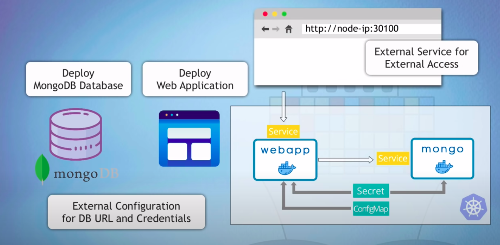

<div align="center">
    
  <h3 align="center">k8s-web-mongodb 101</h3>
</div>

## k8s core components with notes

- node

```
1. physical/virtual machines
```

- pod

```
1. abstraction over container - ephemeral
2. 1 application per pod and own 1 IP address
```

- service

```
1. permanent IP addrress (attached to pod)
    a. Internal Service - default service
    b. External Service - for outer world to access the service (web app for instance)
    c. Ingress Service - forwarding to service (traffic), domain mapping, https, load balancing
```

- configmap

```
1. external config to application (plaintext)
2. to store non sensitive data such as backend url etc
```

- secret

```
1. similar like configmap but encrypted with base64
2. store sensitive data such as database password, certificates etc
```

- volume

```
1. for database data persistent, can be local (in cluster) or remote
```

- deployment

```
1. abstraction over pods
2. blueprint for pods @ replica
3. for stateless app only (deploy database or stateful apps/system with statefulset kind)
```

- statefulset

```
1. deploy database
2. syncing read and write @ replica
```

### K8s manifest files

- [mongo config](db/mongo-config.yaml)
- [mongo secret](db/mongo-secret.yaml)
- [deploy mongo](db/mongo-deploy.yaml)
- [front end service](web/app-deploy.yaml)

### K8s commands

#### start Minikube and check status

    minikube start --driver=docker
    minikube status

#### get minikube node's ip address

    minikube ip

#### get basic info about k8s components

    kubectl get node
    kubectl get pod
    kubectl get svc
    kubectl get all

#### get extended info about components

    kubectl get pod -o wide
    kubectl get node -o wide

#### get detailed info about a specific component

    kubectl describe svc {svc-name}
    kubectl describe pod {pod-name}

#### get application logs

    kubectl logs {pod-name}

#### stop your Minikube cluster

    minikube stop

<br />

> :warning: **Known issue - Minikube IP not accessible**

If you can't access the NodePort service webapp with `MinikubeIP:NodePort`, execute the following command:

    minikube service webapp-service

<br />

### Links

- mongodb image on Docker Hub: https://hub.docker.com/_/mongo
- webapp image on Docker Hub: https://hub.docker.com/repository/docker/nanajanashia/k8s-demo-app
- k8s official documentation: https://kubernetes.io/docs/home/
- webapp code repo: https://gitlab.com/nanuchi/developing-with-docker/-/tree/feature/k8s-in-hour
